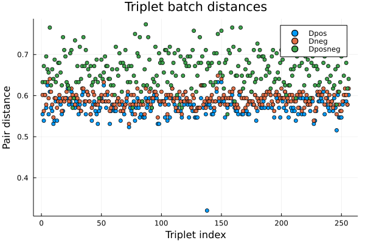

# NeuralOverlap


## Introduction
Assembling a reference genome from a large set of sequence reads remains a challenging task even for modern hardware. Moreover, existing methods are data-independent (rule-based), and are not readily integratable into modern machine learning pipelines.

As evidenced by the success of [AlphaFold](https://deepmind.com/research/open-source/alphafold), machine learning systems can offer huge benefits over classical methods in the biological space. Such technologies are bolstered by the exponential increase in quality training data, advances in compute infrastructure and hardware, and the continual improvement of machine learning techniques. It is our opinion that such methods will bring about the next generation of healthcare and deeper fundamental understanding of the evolutionary process.

For this work, we focus on the specific problem within genome assembly of identifying overlapping sequence reads. This problem can be understood as identifying the nearest-neighbours of a sequence read (with respect to edit distance). The naive solution to this problem is to perform an O(N^2) pairwise comparison of sequence reads, but this quickly becomes intractable for realistic datasets (where N is millions of sequence reads). Many indexing heuristics have been established to greatly improve performance, but these methods lack data-dependence and do not offer the benefits of a machine learning approach.

To this end, we propose a neural approach to computing edit distance which learns data-dependent embeddings for each sequence read, and comparisons of edit distance can be done by calculating the Euclidean distance between sequence reads.

In order to scale the method for inference, we index sequence embeddings into Faiss, permitting efficient nearest-neighbour search over large datasets. We show that we're able to obtain top-1 and top-5 recall rates from ~60%-90% after scanning a relatively small number of items, drastically reducing the search space compared to a linear scan.

<ins> Related work: </ins> </br>

[Neural-Distance-Embeddings-for-Biological-Sequences](https://deepmind.com/research/publications/2021/Neural-Distance-Embeddings-for-Biological-Sequences)

[Convolutional-Embedding-for-Edit-Distance](https://arxiv.org/abs/2001.11692)

## Methodology

### <ins> Simulated sequence reads datasets </ins>

To validate our method, we use simulated sequence reads obtained by sampling real-world genomic (viral) datasets. In particular, we simulate Illumina MiSeq reads (300bp long) by sampling segments from the RefSeq genomes of Acanthamoeba Castellanii Mamavirus and Megavirus Chiliensis viruses.

Because our model by default is trained to compare sequences of 128bp in length, and in the spirit of the Overlap Layout Concensus (OLC) algorithm's methodology, we extract 128bp prefix and suffix segments from each simulated read to populate our datasets. In this way, our network learns to compare the prefix/suffix of one read against the prefix/suffix of all other reads in the dataset.

### <ins> Sequence similarity </ins>
In our experiment, we use the Hamming distance to measure the similarities of sequences as a simplification. Because Levenshtein distance is more appropriate for genomic applications, this is an area for future work.

### <ins> Mapping read embeddings to Euclidean space for efficient nearest neighbour search </ins>
We adopt the same methodology as
[Convolutional-Embedding-for-Edit-Distance](https://arxiv.org/abs/2001.11692), whereby we train a CNN model to learn embeddings for sequence reads, mapping reads to a space where Euclidean distance is representative of edit distance.

During the training process, we use triplet loss to optimize for both reconstruction error (Euclidean distance between similar sequences should be small) and rank error (distance should be smaller for more similar sequences).

By mapping each sequence read to Euclidean space, we can leverage vector quantization methods such as [Faiss](https://github.com/facebookresearch/faiss), where indices permit very efficient approximate nearest neighbour search. Leveraging such technologies is particularly helpful for this use case, since the distribution of nearest neighbours is highly non-uniform (there are only a handful of similar reads and a large number of highly dissimilar reads, with very few datapoints in between).  

### <ins> Using top-T-recall-at-K as our primary performance metric </ins>

In principle, the proposed method is a recommendation system for identifying the (approximate) nearest neighbours for a sequence read. To this end, we evaluate our model using the top-T-recall-at-K metric. This metric identifies how many recommendations need to be scanned (K) in order to identify the top T nearest neighbours. For example, when T=1, the metric will identify (on average) how many recommended items need to be scanned in order to obtain confidence that the true top-1 nearest neighbour is identified.


## Installation

### <ins> Prerequisites </ins>
- Linux with GPU (tested on Ubuntu 20.04, CUDA 11.4, nvidia driver 470.82.01, Nvidia 2080Ti)
- Julia (tested on Version 1.6.4)
- Python >= 3.6


### <ins> Installation from source </ins>
```
git clone git@github.com:lajd/NeuralOverlap.git
cd NeuralOverlap
```


### <ins> Activating the Julia environment </ins>
Activate the environment and perform precompilation.

```shell script
julia
```

```julialang
using Pkg

Pkg.activate(".")
Pkg.instantiate()
Pkg.precompile()
```

## Preparing the dataset

In a new terminal, cd into the repository root and install the Python requirements
### <ins> Install python dependencies </ins>
```shell script
pip install -r requirements.txt
```

### <ins> Download viral sequence data for training/validation/testing/inference </ins>

Configure dataset paths
```
RELATIVE_RAW_GENOME_PATH=data/raw_data/full_genomes
RELATIVE_SIMULATED_READS=data/raw_data/simulated_reads
```

Prepare the training and validation data, generating 20000 training reads samples from the Acanthamoeba castellanii mamavirus genome

```shell script

GENOME_NAME=acanthamoeba_castellanii_mamavirus
mkdir -p $RELATIVE_SIMULATED_READS/$GENOME_NAME

iss generate \
  --genomes $RELATIVE_RAW_GENOME_PATH/$GENOME_NAME.fa \
  --model miseq \
  --output $RELATIVE_SIMULATED_READS/$GENOME_NAME/train \
  -n 20000
```

Prepare the testing/inference data, generating 100000 testing/inference reads sampled from the Megavirus chiliensis genome

```
GENOME_NAME=megavirus_chiliensis
mkdir -p $RELATIVE_SIMULATED_READS/$GENOME_NAME

iss generate \
  --genomes $RELATIVE_RAW_GENOME_PATH/$GENOME_NAME.fa \
  --model miseq \
  --output $RELATIVE_SIMULATED_READS/$GENOME_NAME/infer \
  -n 100000
```

## Run the example experiment

### <ins> Running an experiment with custom parameters </ins>

```shell script
include("src/experiment_helper.jl")
include("src/utils/Utils.jl")
include("src/models/Models.jl")
include("src/dataset/Dataset.jl")

include("src/trainer.jl")
include("src/inference.jl")

include("src/NeuralOverlap.jl")
include("src/experiment_helper.jl")

using Flux

using .NeuralOverlap: run_experiment

function main()::Nothing
    experiment_args = ExperimentParams(
        # Dataset size
        NUM_TRAIN_EXAMPLES=10000,
        NUM_EVAL_EXAMPLES=5000,
        NUM_TEST_EXAMPLES=50000,
        MAX_INFERENCE_SAMPLES=10000,
        NUM_BATCHES_PER_EPOCH=128,
        NUM_EPOCHS=50,
        USE_SYNTHETIC_DATA = false,
        USE_SEQUENCE_DATA = true,
        # Models
        N_READOUT_LAYERS = 1,
        READOUT_ACTIVATION = relu,
        N_INTERMEDIATE_CONV_LAYERS = 3,
        CONV_ACTIVATION = identity,
        USE_INPUT_BATCHNORM = false,
        USE_INTERMEDIATE_BATCHNORM = true,
        USE_READOUT_DROPOUT = false,
        CONV_ACTIVATION_LAYER_MOD = 2,
        # Pooling
        POOLING_METHOD = "mean",
        POOL_KERNEL = 2,
        # Model
        OUT_CHANNELS = 8,
        KERNEL_SIZE = 3,
        EMBEDDING_DIM = 128,
        DISTANCE_METHOD ="l2",
    )

    run_experiment(experiment_args)
    return nothing
end

main()

```


## Results (example experiment)
In the below experiment, we've trained our edit-distance model on simulated reads sampled from the mamavirus reference genome (for both training and validation sets), and tested our model on simulated reads from the megavirus genome.

From the recall-at-k curves, we can see that we're able to identify relevant recommendations must faster than is possible with a linear scan. In particular, the performance of the top-1 and top-5 curves show that we're capable of identifying the nearest neighbours after scanning a relatively small number of items. Because the distribution of read similarity is highly non-uniform (there's only a few overlapping reads in the dataset with significant similarity, the majority of reads share random or 25% similarity), being able to correctly identify the top1 and top5 items is of particular interest.

Below we summarize the mode's performance depicted in the recall-at-k curves, as well as the time
taken to compute true and approximate nearest neighbours. We have trained the model on 10'000 examples (mamavirus reads), and test the model on 3 different dataset sizes of 10'000, 25'000 and 50'000 examples (megavirus reads).


### <ins> Training dataset distribution </ins>

From the below plot, we can see that the majority of reads are highly dissimilar and irrelevant to the problem of identifying overlapping reads. There is only a handful of similar reads that are of interest.

#### Fig 1. Plot showing the true KNN distances for a random read (training dataset)


### <ins> Training on the mamavirus genome </ins>


##### Fig 2. Plot showing a sample of the training triplet distances


##### Fig 3. Training loss plot


##### Fig 4. Training recall plot


##### Fig 5. Validation recall plot


### <ins> Testing on the megavirus genome for varying dataset sizes </ins>

##### Fig 6. Testing recall plot (10'000 reads)


##### Fig 7. Time to compute true and approximate NNs (10'000 reads)


##### Fig 8. Testing recall plot (25'000 reads)


##### Fig 9. Time to compute true and approximate NNs (25'000 reads)


##### Fig 10. Testing recall plot (50'000 reads)


##### Fig 11. Time to compute true and approximate NNs (50'000 reads)


## Conclusion
From the above results, we can see that the approximate nearest-neighbour retrieval is able to obtain relatively high recall (in the range of 60%-90%, after ~1000 scanned items, for test datasets ranging from 5000-50000 sequences large) during testing, despite being trained on a much smaller number of examples on reads simulated from a different genome. Moreover, the compute times of the nearest-neighbour approach versus the naive approach show significant benefits as the size of the test dataset increases. Furthermore, Furthermore, the computation of approximate nearest neighbours can be done efficiently with constant memory, since the Faiss index stores all data on disk. In addition, Faiss offers the ability to compute nearest neighbours utilizing a GPU, potentially further improving runtime.

The neural network model responsible for the edit distance computation can be replaced by an arbitrary embedding model -- indeed, the recent work [Neural-Distance-Embeddings-for-Biological-Sequences](https://deepmind.com/research/publications/2021/Neural-Distance-Embeddings-for-Biological-Sequences) has shown improved performance with the transformer model and embedding to a hyperbolic space.

<ins> Future work and next steps </ins> </br>

There is a long way to go before a fully neural-network genome assembly can take place, but there is a recent driving force and community.

In the [Overlap Layout Consensus](https://www.cs.jhu.edu/~langmea/resources/lecture_notes/assembly_olc.pdf) (OLC) method of genome assembly, after overlapping read segments are identified, an read overlap graph must be constructed. After this, the "layout" step permits the identification of a Hamiltonian path through the graph, which identifies the correct order of reads as they appear in the true genome. The read-overlap graph typically contains many complexities which can be simplified and reduced, and a [neural network approach](https://arxiv.org/abs/2011.05013) has already been presented to accomplish such tasks.  

A simplified read-overlap graph permits the identification of Hamiltonian paths throughout the graph, which represent ordered sequences of reads as they appear in the true genome. In general, multiple such non-connected paths (contigs) may be identified, and further processing may be required to to arrange/order such contigs into larger segments (scaffolds). These scaffolds can then be arranged and corrected to obtain a draft for the true genome.

[Some proposals](https://arxiv.org/abs/2102.02649) use reinforcement learning to assemble the genome from raw sequence reads alone, which represents an attractive approach to fully-neural assembly. These methods, which aim to order sequence reads by assigning reward to read overlaps which move the agent closer to a valid terminal state, show poor performance on even toy datasets due to the explosive state space. It's our opinion, however, that by providing an RL agent effective tools for dealing with the assembly problem (such as the methods discussed here), these methods may help pave the path towards fully neural assembly on realistic datasets. RL methods become even more attractive when considering the plethora of evolutionary genomic data available across all organisms, since such agents may learn to understand the mechanisms of evolution far better than algorithms can learn on isolated datasets.
